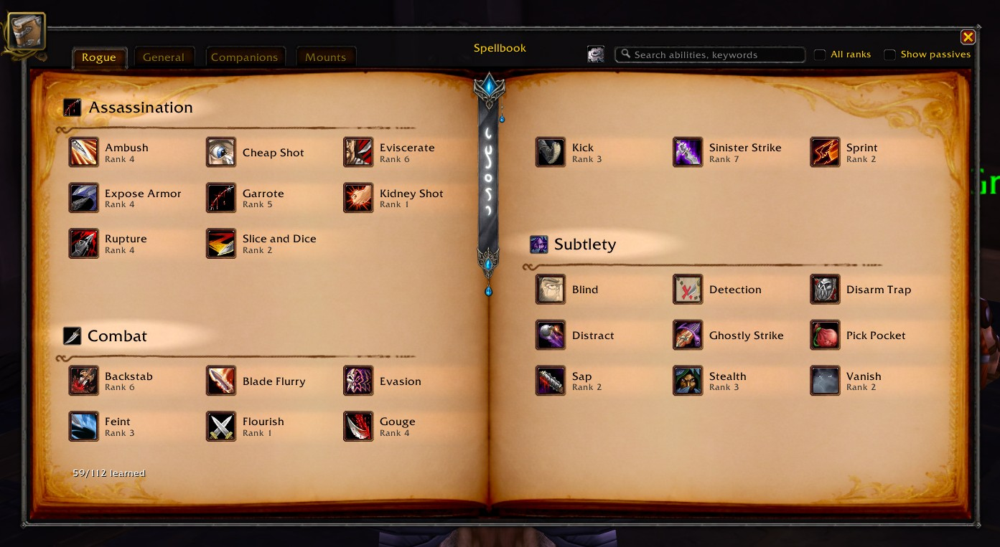

# Teron's Modern Spellbook

A full replacement for the default **World of Warcraft Vanilla 1.12.1** spellbook, rebuilt
to look and feel like the modern Retail spellbook — tabs, badges, glowing "available to
train" highlights, a search bar, and a real settings menu, instead of the plain paginated
list Blizzard shipped in 2006.

This is Kaloyan "Terongorus" Kolev's personal fork of the community **ModernSpellBook**
port (itself a port of the WoW Classic Season of Discovery addon of the same name),
maintained to work on both **Turtle WoW** and pure **Vanilla 1.12.1** servers such as
**TwinStar Kronos V**.

---

## Features

- **Two-page book layout** with parchment background and bookmark, matching the original
  spellbook's art style but laid out cleanly instead of cramped into one page.
- **Tabbed navigation** — Class spells, General, Pet, and (when applicable) Companions /
  Mounts / Toys grouped into an "Other" tab.
- **Professions subcategory** — profession spells (First Aid, Cooking, gathering skills,
  etc.) are automatically split out from the General tab into their own section.
- **Search bar** — filter the current tab by spell name, rank, category, or description
  keyword.
- **Show/hide passives** and **show all spell ranks** toggles.
- **Unlearned spells shown greyed out** — visit a class trainer once and the addon
  remembers everything it saw, so the "not yet learned" list stays populated across
  sessions without needing to revisit the trainer every time.
  - Talent-gated spells are detected automatically and labeled accordingly.
  - A **"Train"** badge and glow highlight spells you can afford and are high enough level
    for right now.
  - A **"New"** badge highlights spells you just learned, until you hover over them.
- **Live cooldown sweep** on spell icons, same as the default action bars.
- **Stance/aura tracking** — active stance/form icons glow in real time.
- **Full tooltips** for unlearned spells too, built from data captured at the trainer
  (description, level requirement, training cost).
- **Custom talent tree window** (`/msb talents`) — an alternate talent UI alongside the
  spellbook, independent of the vanilla talent frame.
- **Settings menu** (gear icon in the spellbook) with:
  - Show-unlearned-spells toggle
  - Per-category highlight controls (learned glow/badge, available-to-train glow/badge)
  - Font size selector
  - Icon frame visibility per category (spells / other tabs / unlearned)

## WhatsTraining integration

If **[TeronWhatsTraining](../TeronWhatsTraining)** is installed and loaded, it registers
its own native **"What's Training"** tab directly inside this spellbook — same look and
feel as every other tab (icons, badges, tooltips, category headers), instead of the
separate overlay window it used to draw on top of the vanilla spellbook. That tab lists
every spell your class can train, categorized by availability, with training costs and
full tooltips, right alongside your Class/General/Pet tabs.

This integration lives entirely on WhatsTraining's side — ModernSpellBook only needed one
small compatibility guard (see `Spellbook/MSB_Spellbook.lua`) so its legacy WhatsTraining
overlay-detection code doesn't error against the new tab-based version. Nothing needs to
be configured; if both addons are installed, the tab just appears.

## Slash commands

| Command | Effect |
|---|---|
| `/msb` | Toggle between the modern spellbook and the original vanilla one. |
| `/msb talents` | Toggle between the custom talent tree window and the vanilla talent frame. |
| `/msb reset` | Reset all ModernSpellBook settings to their defaults. |
| `/msb rescan` | Clear the cached trainer data (forces a full rescan on your next trainer visit). |
| `/msbdebug` | Diagnostic dump — spell tabs, talent tabs, current tab state, and a phased replay of the spell-collection logic, useful for reporting bugs. |

## Installation

1. Download or clone this repository into your `Interface\AddOns\` folder.
2. Make sure the folder is named exactly `TeronModernSpellBook` — WoW requires the folder
   name to match the `.toc` filename inside it, or the client won't detect the addon.
3. Restart the game client (or `/reload`).

## Unlearned spells

To populate the "not yet learned" spells, visit a class trainer in a major city. The addon
captures the full offered spell list on your first visit (name, rank, cost, level
requirement, description) and reuses that cache across all future sessions — you only need
to revisit a trainer again if you want to refresh stale data (`/msb rescan`), or a
higher-level trainer to capture spells your current one doesn't offer yet.

## Screenshots

### Class Spells

### General & Professions

### Black theme (optional)

## Compatibility

- **Turtle WoW** (Interface 11200) — primary original target.
- **Pure Vanilla 1.12.1** (e.g. TwinStar Kronos V) — fully supported, no Turtle-specific
  dependencies.
- Requires no external dependencies of its own; **TeronWhatsTraining** is an optional
  companion addon that gains a native tab here if present, but ModernSpellBook works
  completely standalone without it.

## How it's built (for the curious)

- **`Lib/`** — a small class/OOP framework (`class "Name" { ... }`) and Lua 5.0/5.1
  compatibility polyfills for APIs Retail/Classic addons take for granted but vanilla's
  client doesn't have (no `hooksecurefunc`, no `string.gmatch`, etc.).
- **`Core/`** — localization strings, the shared icon widget base class, the settings
  menu, and slash commands.
- **`Spellbook/`** — the main feature: the spellbook controller and frame (`CSpellBook`),
  spell data collection/filtering (`CSpellDataService`), trainer-data capture
  (`CTrainerDataService`), tabs, category headers, and individual spell row widgets.
- **`Talents/`** — a fully separate custom talent tree window, sharing only the talent
  data service with the spellbook's talent-derived spell entries.
- **`Debug/`** — the `/msbdebug` diagnostic tool.

The tab system and spell-row rendering are generic enough that a third-party addon (like
TeronWhatsTraining) can register its own tab and feed it data through the same rendering
pipeline every native tab uses — which is exactly what the WhatsTraining integration does.

## Credits

- Original **[ModernSpellBook](https://www.curseforge.com/wow/addons/modern-spellbook)**
  addon for WoW Classic Season of Discovery.
- Turtle WoW 1.12.1 port, ongoing maintenance, and the WhatsTraining tab integration by
  **Kaloyan "Terongorus" Kolev**.
